# termtosvg
>you can copy the text from [raw svg file](https://raw.githubusercontent.com/S-Rajkumar/GitHub_Template/master/termtosvg/termtosvg_demo.svg)

**start termtosvg rec**
>`python3 -m termtosvg`

**stop termtosvg rec**
>`exit` or `Ctrl+D`

